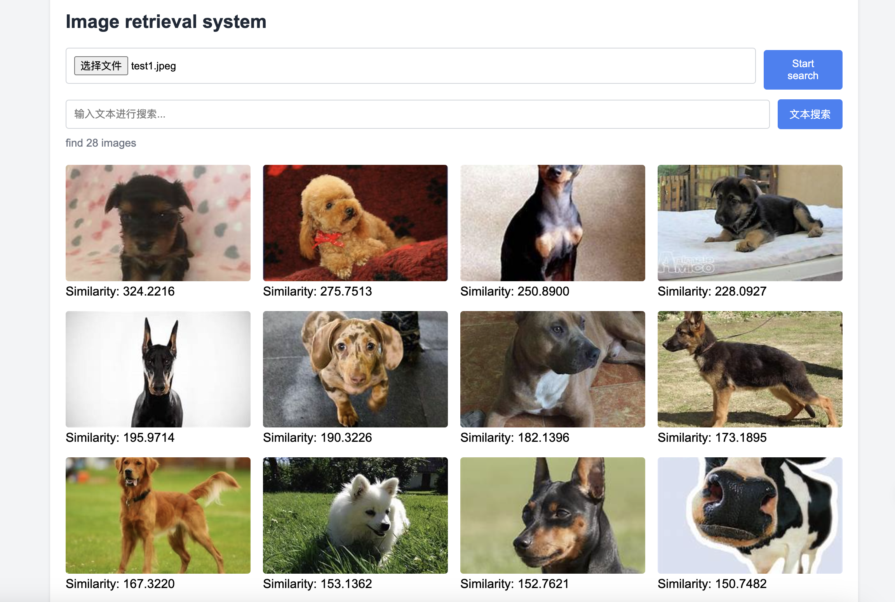

# DINOv2 Image Retrieval System
 <strong>[中文](./README_zh.md) |
    English</strong>
## 🌟 Introduction
This project is an image retrieval system based on the DINOv2 model, allowing users to upload an image and retrieve similar images from a predefined image database.

## 🚀 Features
- Image feature extraction using the DINOv2 model
- Support for different sizes of DINOv2 models (small, base, large, giant)
- Image retrieval based on cosine similarity
- Web interface built with FastAPI
- Feature caching for large-scale image databases

## User Interface



## Installation

1. Clone the repository:

```bash
git clone https://github.com/zheng0116/ImageRetrieval.git
cd ImageRetrieval
```

2. Install dependencies:

```bash
sh run.sh install
```
3. Download the Dinov2 weights
```bash
https://pan.baidu.com/s/1fBVgg_o8PTFEu_2vtLY25Q
Extraction code: f9ww
```
## Usage

1. Prepare your image database by placing images in the `qurary` folder (or specify a custom folder).

2. Run the application:

```bash
sh run.sh start
```

3. Open a web browser and navigate to `http://localhost:5999`.

4. Upload an image and click "Start Retrieval" to find similar images.

## Configuration

You can configure the following parameters when running the application:

- `--model_path`: Path to the DINOv2 model (default: "./Dinov2_model/dinov2-small")
- `--model_size`: Size of the DINOv2 model (choices: small, base, large, giant; default: small)
- `--database_folder`: Path to the image database folder (default: "./qurary")


## Project Structure

- `main.py`: Main application file with FastAPI server
- `model/Diniv2.py`: DINOv2 model loader
- `utils/image_preprocessor.py`: Image preprocessing utilities
- `utils/retrieval_processor.py`: Image retrieval logic
- `static/index.html`: Web interface

## Requirements

- Python 3.7+
- FastAPI
- Uvicorn
- PyTorch
- Transformers
- Pillow
- NumPy

## License

[MIT License](LICENSE)

## Acknowledgements

- [DINOv2](https://github.com/facebookresearch/dinov2) by Facebook Research
- [FastAPI](https://fastapi.tiangolo.com/)