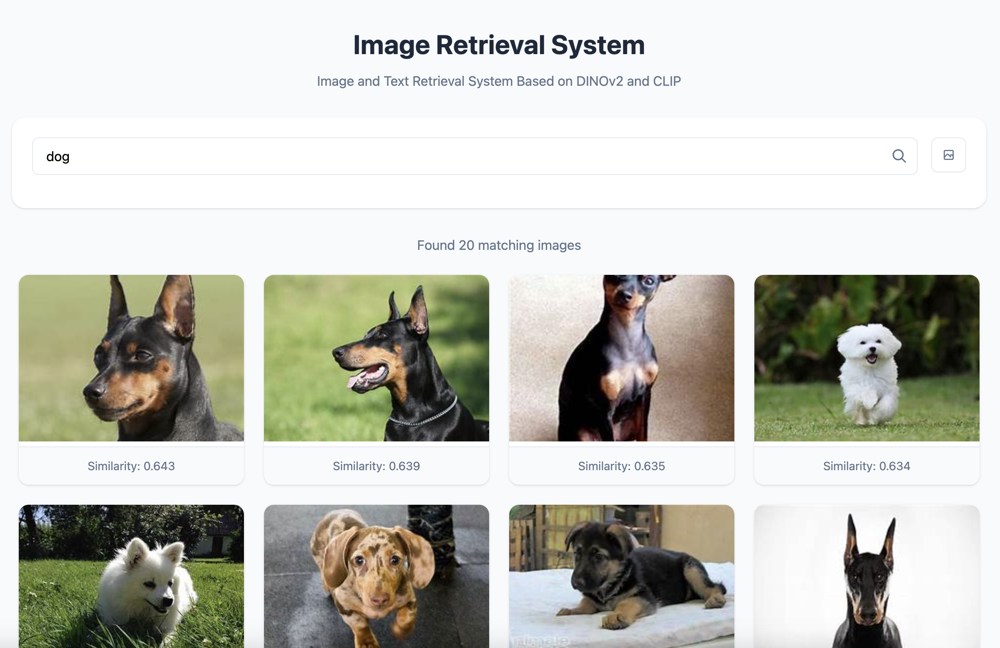

# 图像检索系统
 <strong>[中文](./README_zh.md) |
    [English](./README.md)</strong>
## 🌟 概述
本项目是基于DINOv2和CLIP模型的图像检索系统，支持以图搜图和以文搜图两种检索方式。用户可以上传图片或输入文本描述，从预定义的图像数据库中检索相似的图像。
## 将来计划
- [x] 支持数据库
- [x] 使用rust实现
- [x] 支持不同模型提取图像特征和文本特征
## 🚀 特征
- 使用DINOv2模型进行图像特征提取和以图搜图
- 使用CLIP模型支持文本到图像的检索
- 支持不同大小的DINOv2模型（小型、基础型、大型、巨型）
- 基于余弦相似度的图像检索
- 使用FastAPI构建的Web界面
- 对大规模图像数据库进行特征缓存

## 用户界面



## 安装

1. 克隆仓库:

```bash
git clone https://github.com/zheng0116/ImageRetrieval.git
cd ImageRetrieval
```

2. 安装依赖项:

```bash
sh run.sh install
```

3. 下载DINOv2模型:
```bash
https://pan.baidu.com/s/1fBVgg_o8PTFEu_2vtLY25Q 
提取码: f9ww 
```

4. 配置环境变量:
在根目录创建 `.env` 文件，内容如下：
```bash
SERVER_URL="0.0.0.0"
SERVER_PORT=5999
MODEL_PATH="./Dinov2_model/dinov2-small"
MODEL_SIZE="small"
DATABASE_FOLDER="./quary"
```

## 使用方法

1. 准备您的图像数据库，将图片放置在`quary`文件夹中（或在.env中指定自定义文件夹）。

2. 运行应用程序:

```bash
sh run.sh start
```

3. 打开浏览器访问 `http://localhost:5999`。

4. 检索方式：
   - 以图搜图：上传图片并点击"开始检索"
   - 以文搜图：在文本框中输入描述并点击"文本搜索"

## 配置

您可以在.env文件中配置以下参数:

- `SERVER_URL`: 服务器IP地址（默认："0.0.0.0"）
- `SERVER_PORT`: 服务器端口号（默认：5999）
- `MODEL_PATH`: DINOv2模型的路径（默认："./Dinov2_model/dinov2-small"）
- `MODEL_SIZE`: DINOv2模型的大小（可选：small, base, large, giant；默认：small）
- `DATABASE_FOLDER`: 图像数据库文件夹的路径（默认："./quary"）

## 项目结构

- `main.py`: 主应用程序文件，包含FastAPI服务器
- `retrieval/services/model/Diniv2.py`：DINOv2模型加载器
- `retrieval/services/model/clip.py`: CLIP模型加载器
- `retrieval/services/utils/image_process.py`: 图像预处理工具
- `retrieval/services/retrieval.py`: 图像检索主逻辑
- `static/index.html`: Web界面
- `config` : 日志配置、模型初始化和路由配置

## 配置需求

- Python 3.7+
- FastAPI
- Uvicorn
- PyTorch
- Transformers
- Pillow
- NumPy
- tqdm

## License

[MIT License](LICENSE)

## 致谢

- [DINOv2](https://github.com/facebookresearch/dinov2) by Facebook Research
- [CLIP](https://github.com/openai/CLIP) by OpenAI
- [FastAPI](https://fastapi.tiangolo.com/)